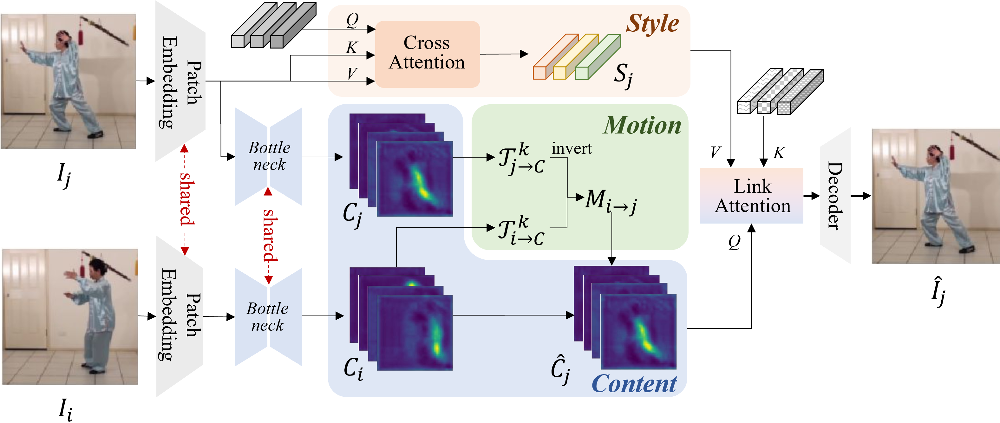
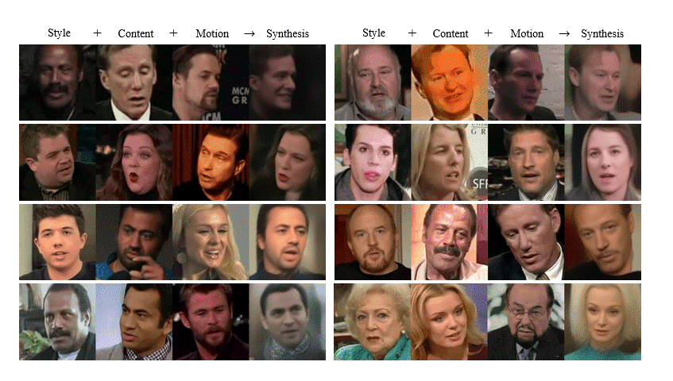
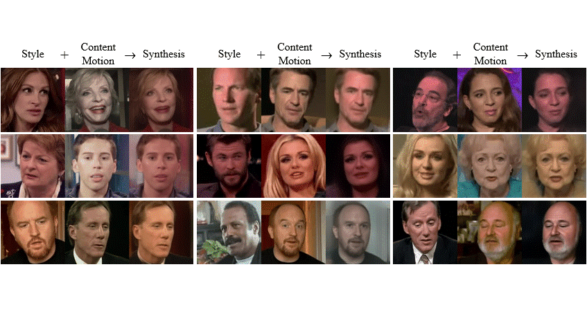
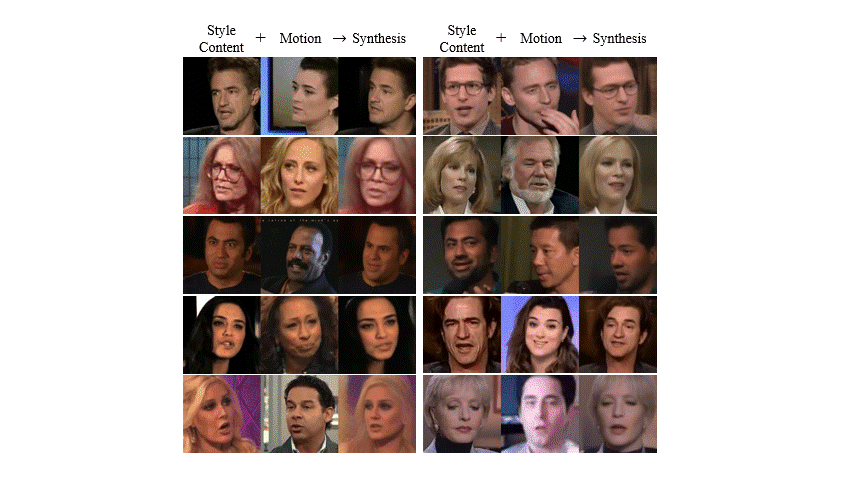
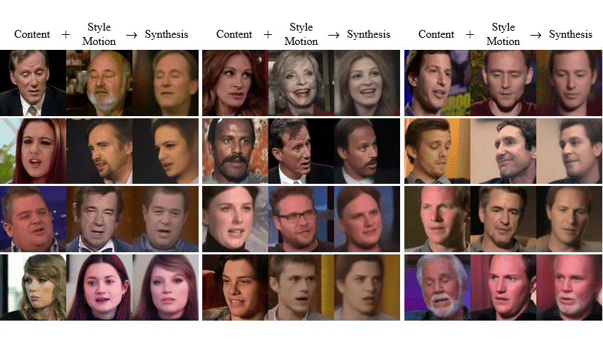

# Decomposing Style, Content, and Motion for Videos 
[[Paper](https://doi.org/10.1016/j.jvcir.2022.103686)]


## Paper Introduction
In this paper, we present the first video decomposition framework, named SyCoMo, that factorizes a video into style, content, and motion. Such a fine-grained decomposition enables flexible video editing, and for the first time allows for tripartite video synthesis. SyCoMo is a unified and domain-agnostic learning framework which can process videos of various object categories without domain-specific design or supervision. Different from other motion decomposition work, SyCoMo derives motion from style-free content by isolating style from content in the first place. Content is organized into subchannels, each of which corresponds to an atomic motion. This design naturally forms an information bottleneck which facilitates a clean decomposition. Experiments show that SyCoMo decomposes videos of various categories into interpretable content subchannels and meaningful motion patterns. Ablation studies also show that deriving motion from style-free content makes the keypoints or landmarks of the object more accurate. We demonstrate the photorealistic quality of the novel tripartite video synthesis in addition to three bipartite synthesis tasks named as style, content, and motion transfer.

## Method


## Synthesized results
### Tripartite synthesis



### Bipartite synthesis
#### Style Transfer




#### Motion Transfer



#### Content Transfer



## Citation
```bash
@article{HU2022103686,
title = {Decomposing style, content, and motion for videos},
journal = {Journal of Visual Communication and Image Representation},
pages = {103686},
year = {2022},
issn = {1047-3203},
doi = {https://doi.org/10.1016/j.jvcir.2022.103686},
url = {https://www.sciencedirect.com/science/article/pii/S1047320322002061},
author = {Yaosi Hu and Dacheng Yin and Yuwang Wang and Zhenzhong Chen and Chong Luo},
}
```

